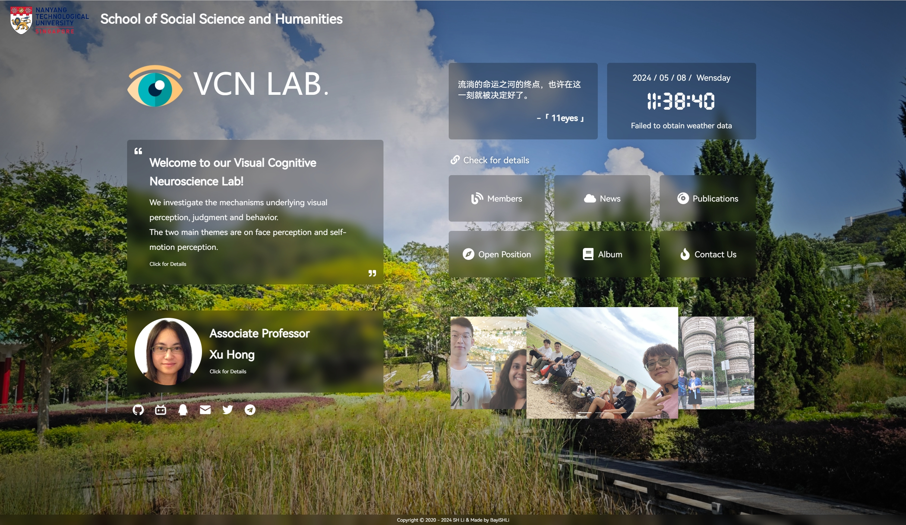

<p>
<strong><h2>VCN-LAB Site Demo</h2></strong>
The demo version of the homepage for Visual Congnitive Neuroscience Lab.
</p>



>The logo font on the home page has been compressed, so if you use a font other than this logo, it will change back to the default font, Here is the [full font](https://file.4everland.app/font/Other/Pacifico-Regular.ttf)  


### Functions

- [x] Loading animation
- [x] Background switch
- [x] Site description
- [x] Principle investigator introduction
- [x] Team members introduction
- [x] Album carousel
- [ ] Open position
- [ ] News


### Deployment

* **Installation** [node.js](https://nodejs.org/zh-cn/) **Environment**

  > node > 16.16.0  
  > npm > 8.15.0
  
* Then run the `cmd` terminal with **administrator privileges** and `cd` to the project root directory
* In the `terminal` type:

```bash
# Install pnpm
npm install -g pnpm

# Install the dependencies
pnpm install

# Preview
pnpm dev

# Build
pnpm build
```

> Once the build is complete, the files in the `dist` folder can be uploaded to the server or imported and automatically deployed with one click using a hosting platform such as `Vercel`.


### Fonts

Now using `HarmonyOS Sans` open source font, using font splitting to improve loading speed

>Because this site's `CDN` has opened anti-leech, **non-site domain name is not accessible**, please change the font import link to the following content, otherwise **custom fonts will be invalid**
>
>`https://cdn.jsdelivr.net/gh/imsyy/file/font/HarmonyOS_Sans/regular.min.css`

<details>
<summary>old way</summary>

>As Chinese fonts are introduced in this project, Chinese fonts need to be compressed to improve the loading speed of the page (you can also cancel the use of Chinese fonts)

#### Chinese font removal traditional

- Install `Python 3.7` and `pip`
- Run `pip install fonttools`
- Download [sc_unicode.txt](https://gist.githubusercontent.com/imaegoo/d64e5088b723c2e02c40985f55ff12db/raw/5ebd2ce49418c73459a9dfe050483409306a6c1d/sc_unicode.txt)
- Run `pyftsubset font-name.ttf --unicodes-file=sc_unicode.txt`

#### fonts further compressed

- Compile and install ``Google woff2``

```bash
sudo apt-get install -y git g++ make
git clone --recursive https://github.com/google/woff2.git
cd woff2
make clean all
```

- Compress the font again

```
. /woff2_compress . /font_name.ttf
```

- Eventually the original font can be slow loaded, **load the compressed font first**

>For more information, please go to [虹墨空间站](https://www.imaegoo.com/2020/chinese-font-compress/) to view the original article

</details>

### Technology Stack

* [Vue](https://cn.vuejs.org/)
* [Vite](https://vitejs.cn/vite3-cn/)
* [Pinia](https://pinia.vuejs.org/zh/)
* [IconPark](https://iconpark.oceanengine.com/official)
* [xicons](https://xicons.org/)
* [Aplayer](https://aplayer.js.org/)

### Acknowledgement

This demo homepage is developed based on [home](https://github.com/imsyy/home)


